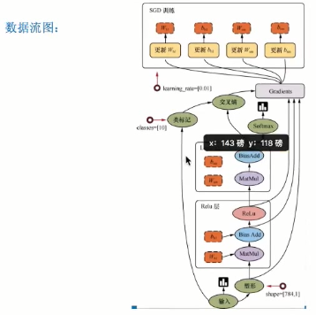

[TOC]

# 深度学习

## TensorFlow安装

```bash
C:\Users>pip install tensorflow

Looking in indexes: https://pypi.tuna.tsinghua.edu.cn/simple
Requirement already satisfied: tensorflow in e:\python\python36\lib\site-packages (1.12.3)
Requirement already satisfied: tensorboard<1.13.0,>=1.12.0 in e:\python\python36\lib\site-packages (from tensorflow) (1.12.2)
Requirement already satisfied: gast>=0.2.0 in 

C:\Users>pip show tensorflow

Name: tensorflow
Version: 1.12.3
Summary: TensorFlow is an open source machine learning framework for everyone.
Home-page: https://www.tensorflow.org/

# 安装指定版本
pip install tensorflow==1.8.0
```

## TensorFlow

- tensor:张量
- operation（op）：专门运算的操作结点所有操作都是一个op
- 图（graph）：整个程序的结构
- 会话：运算程序的图
  - tf.Session()运行TensorFlow操作图的类，使用默认注册的图（可以指定运行图）。
  - 上下文管理器 

    ```python
    with tf.Session() as sess:
        sess.run(...)
    ```



## 卷积神经网络RNN（图像）

## 循环神经网络CNN（自然语言处理
