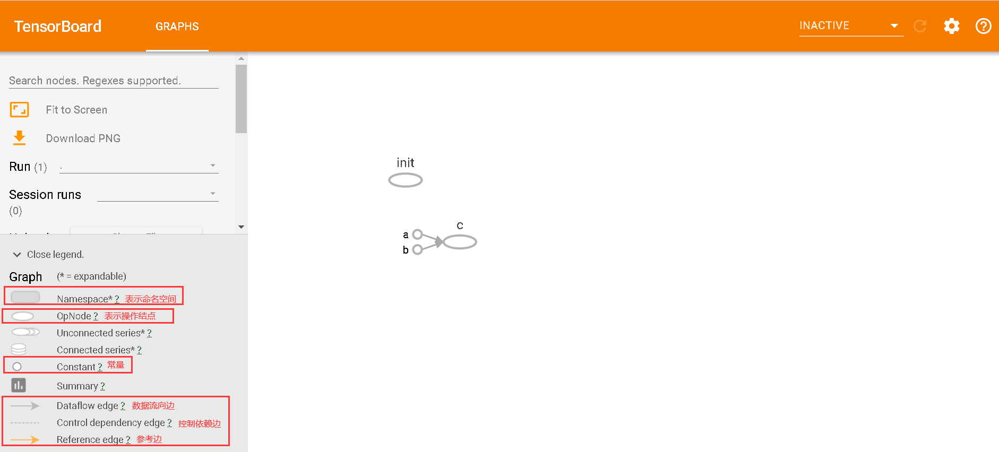

# ­­Tensorflow数据流图

## Tensorflow的计算图结构

- tensorflow图结构流程图表示如下：



<!--  -->
## Tensorboard使用

### 1.未使用zhmh封装Tensorboard包

- 直接添加Tensorboard.py文件即可
@import "03_Tensorboard_01.py"

### 2.使用zhmh封装Tensorboard封装包

#### 安装zhmh封装Tensorboard封装包

```python
C:\Users\Gaoyu>pip install EasyTensorBoard

Looking in indexes: https://pypi.tuna.tsinghua.edu.cn/simple
Collecting EasyTensorBoard
```

@import "03_Tensorboard_02.py"

- zhmh的Tensorboard封装包
@import "Tensorboard.py"