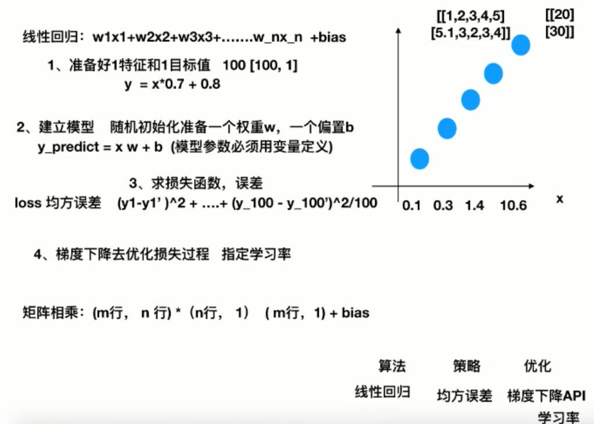
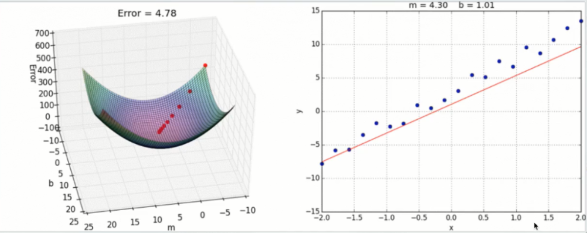

# 线性回归



```python
import tensorflow as tf

def bxy_regression():
    """
    线性回归预测
    :return:
    """
    # 1、准备数据，x特征值[100, 1]  y目标值[100]
    x = tf.random_normal([100, 1], mean=1.75, stddev=0.5, name="x_data")

    # 矩阵相乘必是二维的，tf.matmul(x, w)矩阵运算
    y_true = tf.matmul(x, [[0.7]]) + 0.8

    # 2、建立线性回归模型 1个特征  1个权重 一个偏置  y = xw +b
    # 随机给一个权重和偏置的值，让他去计算损失，然后再当前状态下优化
    weight = tf.Variable(tf.random_normal([1, 1], mean=0.0, stddev=1.0), name="w")
    bias = tf.Variable(0.0, name="b")

    y_predict = tf.matmul(x, weight) + bias

    # 建立损失函数，均方误差，tf.square(error)平方，reduce_mean(error)均值
    loss = tf.reduce_mean(tf.square(y_true - y_predict))

    # 梯度下降损失函数 learning_rate :0~1, 2, 3,5, 7, 10
    train_op = tf.train.GradientDescentOptimizer(0.1).minimize(loss)

    # 定义一个初始化变量op
    init_op = tf.global_variables_initializer()

    # 通过会话运行程序
    with tf.Session() as sess:
        # 初始化变量
        sess.run(init_op)
        # 打印随机最先初始化的权重和偏置，eval()计算并返回此变量的值
        print("随机初始化的参数权重为：%f , 偏置为：%f" % (weight.eval(), bias.eval()))
        print("_"*50)

        #  循环训练 运行优化
        for i in range(200):
            sess.run(train_op)
            print("第 %d 次优化的参数权重为：%f , 偏置为：%f" % (i, weight.eval(), bias.eval()))

        # 运行优化
        sess.run(train_op)
        print("_"*50)
        print("参数权重为：%f , 偏置为：%f" % (weight.eval(), bias.eval()))

    return None

if __name__ == "__main__":
    bxy_regression()
```

